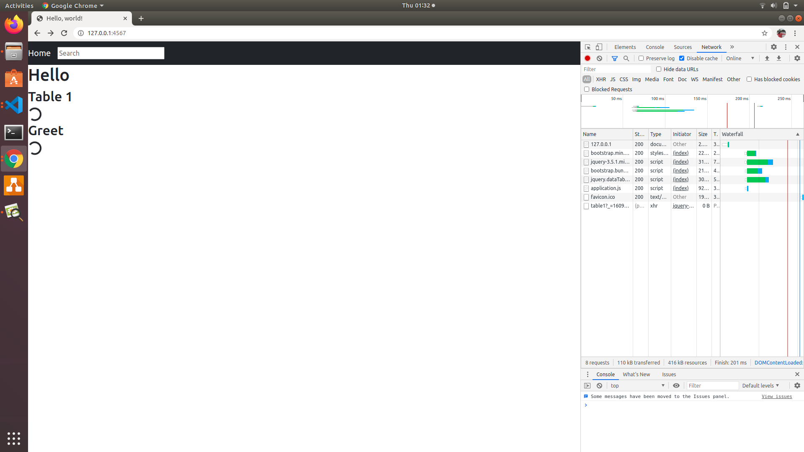
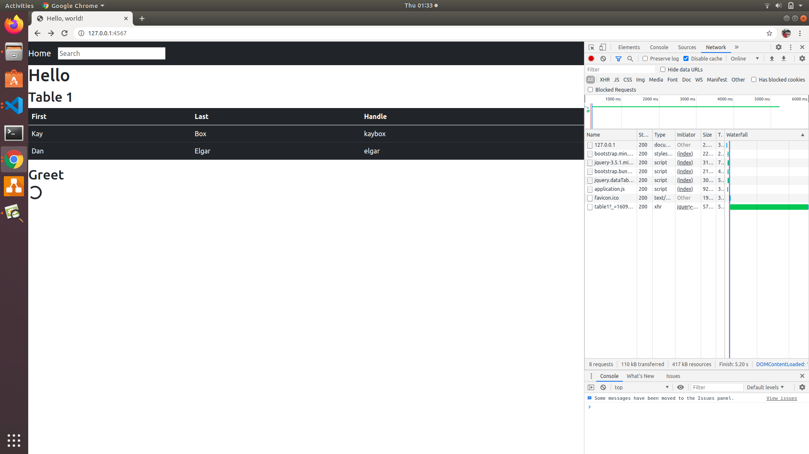
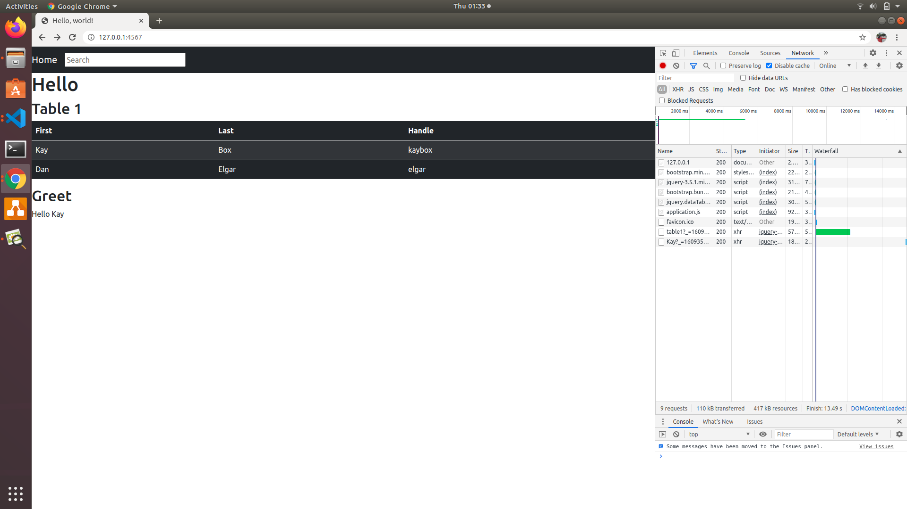

# sinatra_ajax

Demo project to use ajax in sinatra. In this example a table is displayed from ajax response and based on selected table row another ajax request is send with selected row's first column value. I added sleep time before sending ajax data to mimic server computation time.

## Initial page load

## Table Loaded

## Row 1 Selected

## Row 2 Selected

## References

- https://code.jquery.com/
